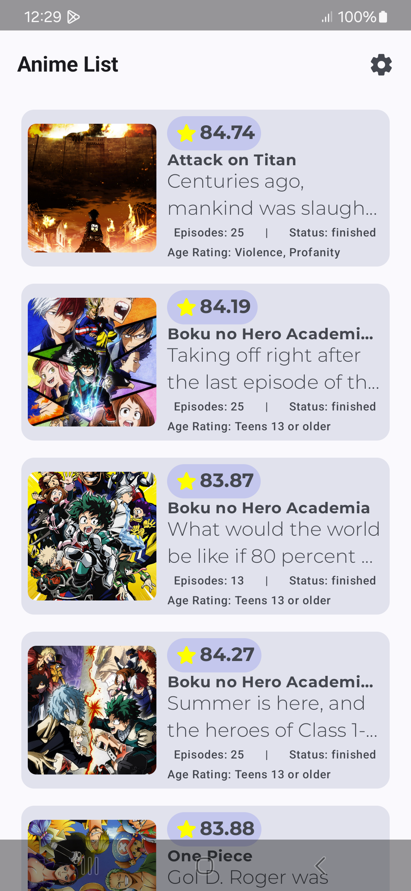
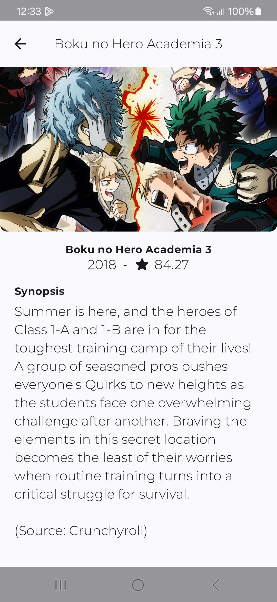
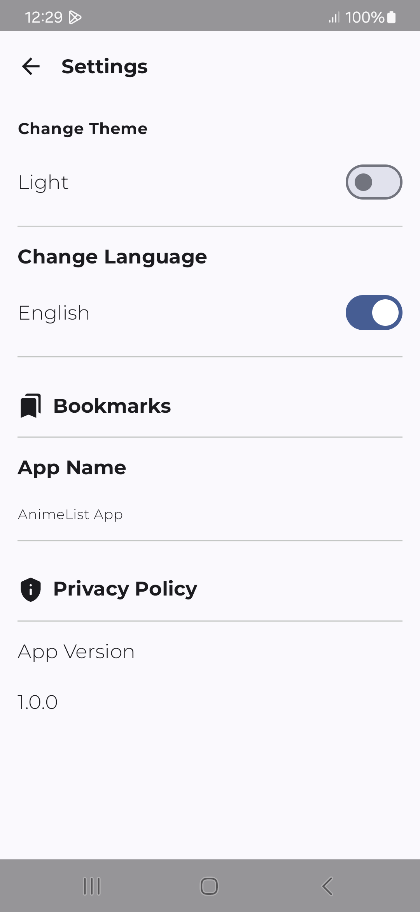
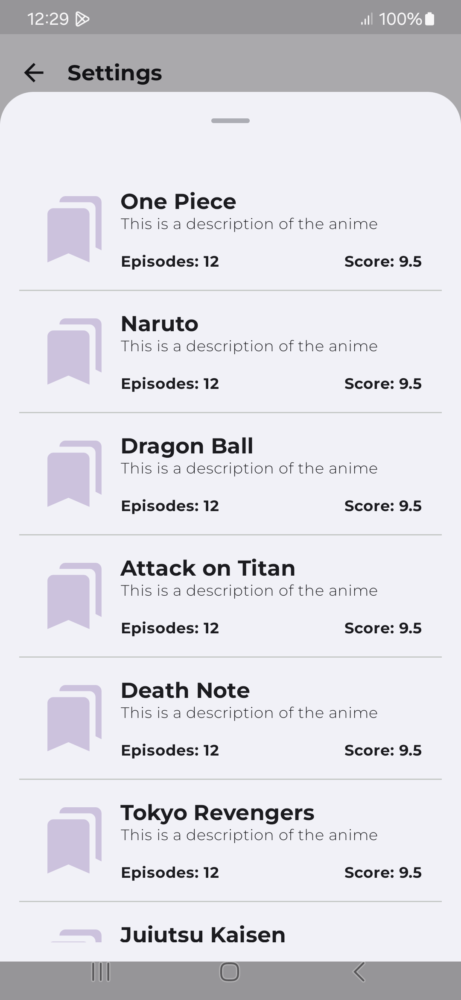

# AnimeTrending

Una aplicación móvil moderna para Android que muestra información sobre anime en tendencia utilizando la API de Kitsu. La aplicación permite a los usuarios explorar animes populares, ver detalles de cada uno, guardar favoritos y personalizar la experiencia de usuario.

## Características

- **Lista de Animes en Tendencia**: Visualización de los animes más populares del momento.
- **Detalles de Anime**: Información detallada de cada anime, incluyendo sinopsis, calificación y fecha de lanzamiento.
- **Marcadores (Bookmarks)**: Guarda tus animes favoritos para acceder rápidamente a ellos.
- **Personalización**: Opciones para cambiar entre tema claro/oscuro e idioma (inglés/español).
- **Diseño Moderno**: Interfaz de usuario intuitiva y atractiva siguiendo los principios de Material Design 3.

## Tecnologías Utilizadas

- **Kotlin**: Lenguaje de programación principal.
- **Jetpack Compose**: Framework moderno para la construcción de UI nativa en Android.
- **Koin**: Para la inyección de dependencias.
- **Coroutines & Flow**: Para operaciones asíncronas y programación reactiva.
- **Navigation Compose**: Para la navegación entre pantallas.
- **Coil**: Para la carga eficiente de imágenes.
- **Retrofit & Moshi**: Para las llamadas a la API y el manejo de JSON.
- **Material 3**: Para implementar el diseño de la interfaz de usuario.

## Capturas de Pantalla

### Lista de Animes y Detalles

### Configuración y Marcadores

## Estructura del Proyecto

- **ui/screen**: Contiene las diferentes pantallas de la aplicación (TrendingAnimeScreen, AnimeScreen, SettingsScreen).
- **data**: Manejo de datos y comunicación con la API.
- **di**: Módulos de inyección de dependencias (KoinModule).
- **model**: Clases de datos y modelos.
- **navigation**: Configuración de navegación entre pantallas.

## Arquitectura

La aplicación sigue el patrón de arquitectura MVVM (Model-View-ViewModel) junto con Clean Architecture para mantener un código limpio, testeable y escalable.

## Demo

<video height="420" controls>
  <source src="demo/demo.mp4" type="video/mp4">
  Tu navegador no soporta videos HTML5.
</video>

## Instalación

1. Clona este repositorio
2. Abre el proyecto en Android Studio
3. Ejecuta la aplicación en un emulador o dispositivo físico

## Requisitos

- Android Studio Arctic Fox o superior
- Kotlin 1.8.0 o superior
- Android SDK 24+
- Gradle 8.0+